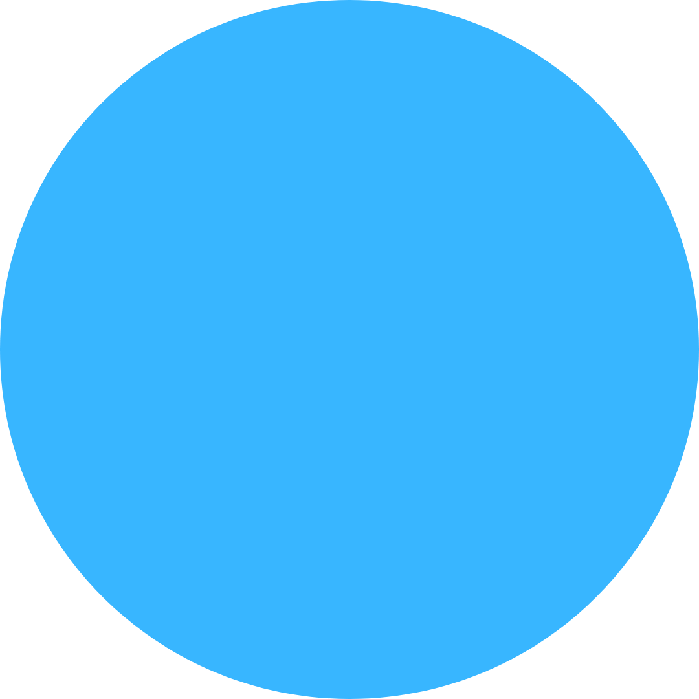
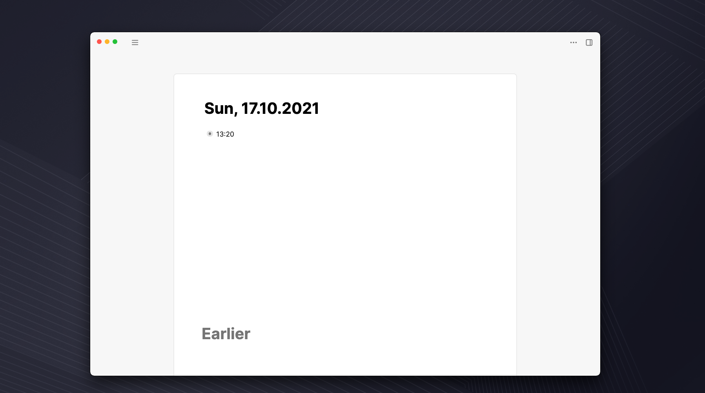

# Paper Theme



The [Logseq](https://logseq.com/) Paper theme is a minimal theme, where the page and journal container is elevated from the user interface. Therefore putting it front and center for a distractionless writing experience.

> If you like this template, consider [buying me a coffee](https://www.buymeacoffee.com/wirtzdan) :)

The theme is build on top of the great [Logseq Dev Theme](https://github.com/pengx17/logseq-dev-theme) by [Peng Xiao](https://github.com/pengx17) and inspired by the work of [Fabrizio Rinaldi](https://twitter.com/linuz90) with his [Better Roam Research](https://github.com/linuz90/better-roam-research) theme.

## Screenshot



## Usage

The easiest way to adopt this theme is to use jsDelivr CDN by adding the following lines to your `custom.css`.

```css
/* This must be the first line of the custom.css with other import rules */
@import url("https://wirtzdan.github.io/logseq-paper-theme/custom.css");

/* Add these variables to your custom.css if you want to hide these page elements in the UI. Remove them to make them visible again. */
:root {
  --display-recent-pages: none;
  --display-search-button: none;
  --display-arrow-navigation: none;
  --display-help-button: none;
}

/* You can also add other styles below to override the default theme values */
```

Alternatively, you can download this repo and load it as a Logseq Theme Plugin.

> **🚧 Something doesn't work?**:If you find a bug, please open an issue by [clicking here](https://github.com/wirtzdan/logseq-paper-theme/issues/new).
